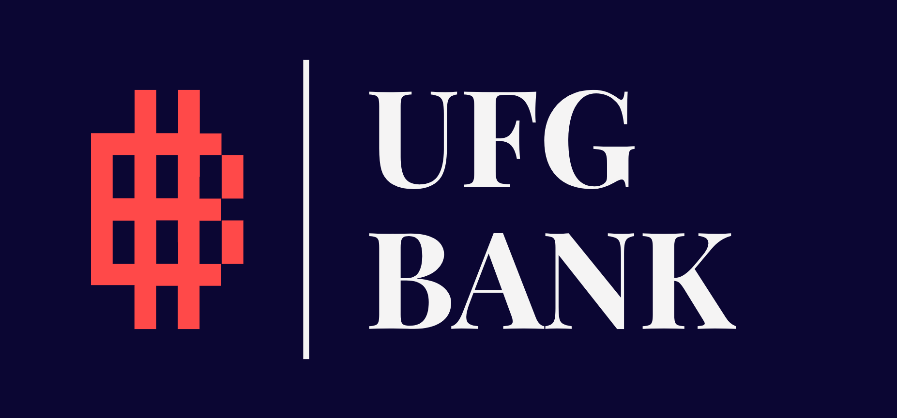

# UFG Bank ATM

ATM Web Application built with ASP.NET Core 6 and MVC pattern

## Tech Stack

**Framework:** .NET 6.0

**ORM:** EntityFramework

**Database:** Mysql

**Migration tool:** dotnet-ef

**Identity provider:** Microsoft.AspNetCore.Identity.EntityFrameworkCore

## Requisitos

- ### Framework

Debes tener instalado el framework .NET 6.0. Si aún no lo has instalado, puedes hacerlo con el comando en windows:

```bash
winget install Microsoft.DotNet.SDK.6
```
Si ya tienes otra version del framework instalada y quieres cambiar de version puedes hacerlo con el comando:
    
```bash
dotnet new globaljson --sdk-version <version a la que quieres cambiar (sin los simbolos de <>)> --force
```
opcionalmente puedes añadir la flag --force en caso de que ya tengas un archivo global.json creado y te de ese error.

- ### Base de datos

También necesitarás tener instalado el motor de base de datos MySQL. Puedes descargarlo desde este [enlace](https://dev.mysql.com/downloads/installer/).
 O si usas Docker puedes usar este docker-compose file que ya tienen las credenciales usadas en el proyecto:

```bash
version: '3.3'
services:
  source:
    container_name: ufg-bank-atm-mysql
    image: mysql:latest
    restart: unless-stopped
    environment:
      MYSQL_ROOT_PASSWORD: root
    ports:
      - "3307:3306"
    volumes:
      - ./mysql/mount:/var/lib/mysql
```

- ### Herramient de migración

Para restaurar las tablas de la base de datos del proyecto necesitarás dotnet-ef

Si no tienes las herramienta puedes instalarla en windows con el siguiente comando:

```bash
  dotnet tool install --global dotnet-ef
```


## Installation

Primero clona el proyecto y luego ejecuta:

```bash
  dotnet restore
```

Para instalar las dependencias necesarias.


## Database Connection

Para ejecutar este proyecto, necesitarás configurar el string de conexión en el archivo `appsettings.json`

actualiza los valores de:

```bash
    "DatabaseConnection": "server=localhost; uid=root; Password=root; database=atm; Port=3307"
```

de acuerdo a tu configuración o utiliza los mismos valores de tu instancia de MySQL.

## Database Migration

Usa la herramienta de migración para crear la base de datos:

```bash
  dotnet ef database update
```
Si necesitas crear una nueva migracion, puedes hacerlo con el comando:

```bash
  dotnet ef migrations add NombreDeMigracion
```


## Run Locally

Para correr el proyecto localmente, ejecuta el siguiente comando:

```bash
  dotnet run
```
estando en la carpeta del proyecto que contiene el achivo `UFG-Bank-ATM.csproj`

## Feedback

Si tienes algún comentario, por favor contáctanos en este [enlace](https://www.youtube.com/watch?v=riT4nl0T8_M).

